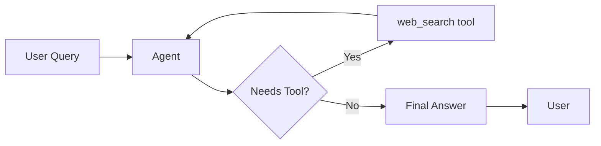
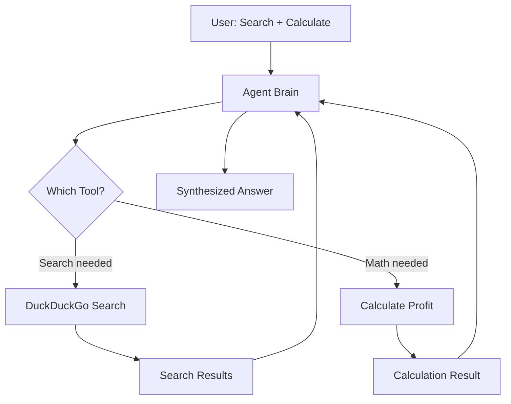
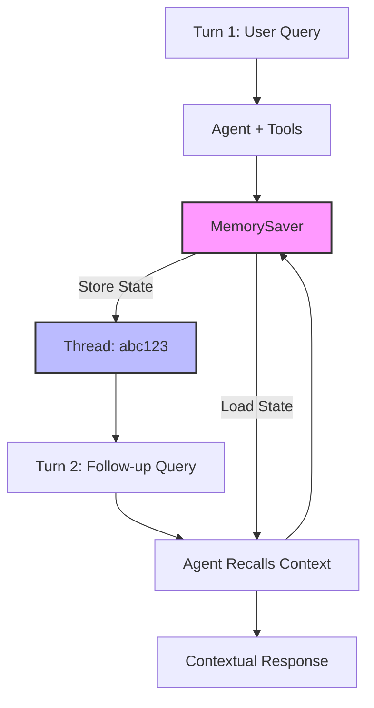
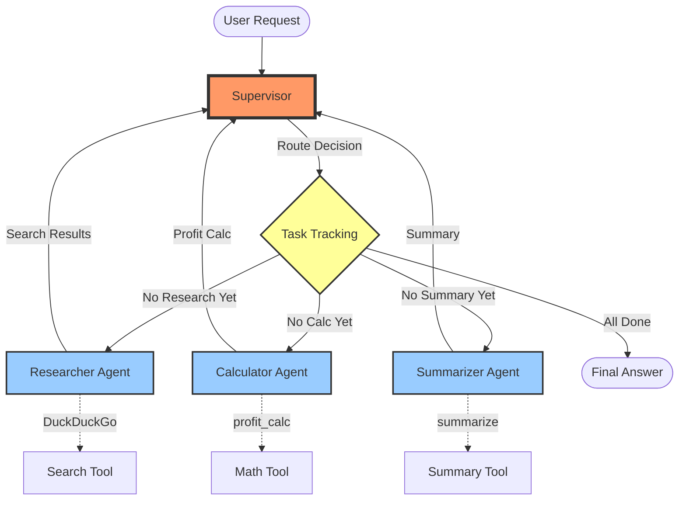
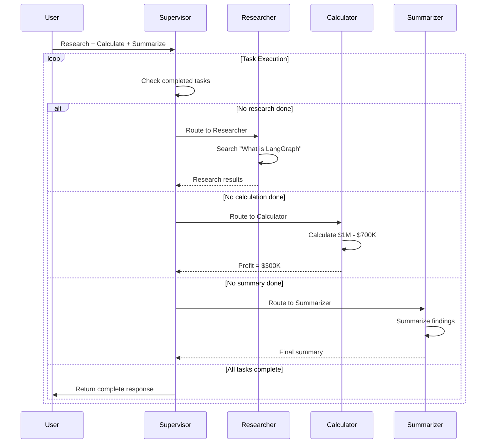
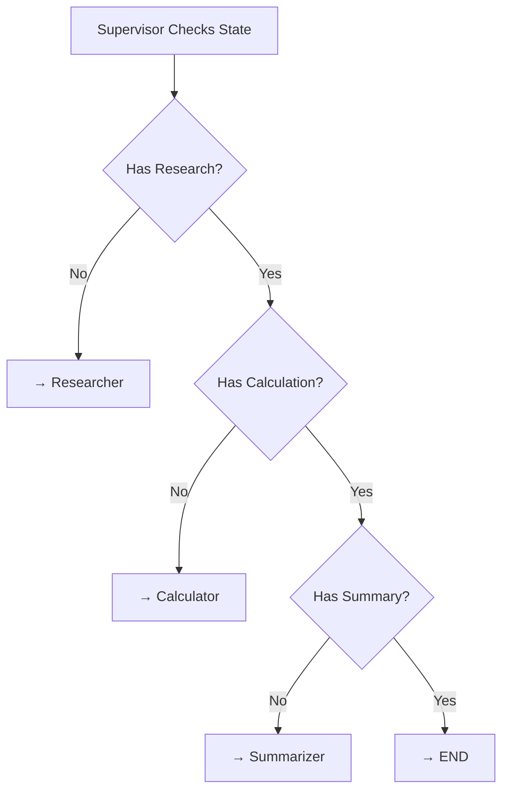

# Agentic AI - Agent Examples Documentation

This document explains the four core agent implementations, progressing from basic to advanced patterns.

---

## Overview

| Agent | Complexity | Key Feature | Use Case |
|-------|-----------|-------------|----------|
| agent_1_basic | ⭐ Basic | Single tool, simple flow | Introduction to agents |
| agent_2_multitool | ⭐⭐ Intermediate | Multiple tools | Real-world search + calculation |
| agent_3_memory | ⭐⭐⭐ Advanced | Conversation memory | Multi-turn interactions |
| agent_4_langgraph | ⭐⭐⭐⭐ Expert | Multi-agent orchestration | Complex workflows |

---

## 1. Agent 1: Basic Agent (agent_1_basic.py)

### Purpose
Introduces the fundamental concept of an AI agent that can use tools autonomously.

### Key Components
- **LLM**: GPT-4o-mini from OpenAI
- **Tool**: `web_search()` - A mock search function
- **Pattern**: Simple ReAct (Reasoning + Acting)

### Architecture Diagram



### How It Works

1. **User asks**: "What is agentic AI?"
2. **Agent reasons**: Decides if it needs to search
3. **Agent acts**: Calls `web_search()` tool
4. **Agent responds**: Provides answer based on search results

### Code Flow
```python
User Input → create_agent → stream(updates)
                ↓
            web_search()
                ↓
            AI Response
```

### Output Example
```
Agentic AI refers to artificial intelligence systems that can operate 
autonomously and make decisions on their own...
```

---

## 2. Agent 2: Multi-Tool Agent (agent_2_multitool.py)

### Purpose
Demonstrates an agent using multiple tools to solve complex, multi-step problems.

### Key Components
- **LLM**: GPT-4o-mini
- **Tools**:
  - `DuckDuckGoSearchResults()` - Real web search
  - `calculate_profit()` - Custom math function
- **Pattern**: Multi-tool orchestration

### Architecture Diagram



### How It Works

1. **User asks**: "Search latest LangChain version. If revenue $500k and cost $350k, what's profit?"
2. **Agent identifies**: Two tasks - search AND calculate
3. **Agent executes**:
   - First: Searches for LangChain version
   - Second: Calculates profit ($500k - $350k = $150k)
4. **Agent synthesizes**: Combines both results in one response

### Tool Selection Logic
The agent autonomously decides which tool to use based on:
- Keywords in the query
- Task requirements
- Sequential dependencies

### Output Example
```
The latest version of LangChain is 1.2.16, published 3 days ago.

Regarding the profit calculation, with revenue of $500,000 and cost 
of $350,000, the profit is $150,000.
```

---

## 3. Agent 3: Memory Agent (agent_3_memory.py)

### Purpose
Shows how agents can maintain conversation context across multiple interactions using persistent memory.

### Key Components
- **LLM**: GPT-4o-mini
- **Tools**:
  - `DuckDuckGoSearchRun()` - Web search
  - `summarize_notes()` - Custom summarization
- **Memory**: `MemorySaver()` - Persists conversation state
- **Pattern**: Stateful conversations with checkpointing

### Architecture Diagram



### How It Works

**Turn 1:**
1. User: "What is LangGraph? Search if needed."
2. Agent searches and responds with LangGraph info
3. Memory saves the conversation state with thread_id "abc123"

**Turn 2:**
1. User: "Summarize notes from before."
2. Agent loads previous conversation from memory
3. Agent recalls LangGraph info from Turn 1
4. Agent provides contextual summary

### Memory Configuration
```python
memory = MemorySaver()  # Create checkpointer
config = {"configurable": {"thread_id": "abc123"}}  # Session ID

# Each stream call uses the same config to maintain continuity
agent.stream(input1, config=config, ...)
agent.stream(input2, config=config, ...)  # Remembers Turn 1
```

### Key Differences from Basic Agents
- ✅ Maintains conversation history
- ✅ Can reference previous interactions
- ✅ Enables multi-turn dialogues
- ✅ Thread-based session management

### Output Example
```
Turn 1: LangGraph is an open-source framework that facilitates 
the creation and management of AI agent workflows...

Turn 2: [Recalls Turn 1] LangGraph is an open-source framework 
by LangChain designed for creating AI agent workflows using a 
graph-based approach...
```

---

## 4. Agent 4: Multi-Agent System (agent_4_langgraph.py)

### Purpose
Advanced orchestration of multiple specialized agents working together, coordinated by a supervisor.

### Key Components
- **LLM**: GPT-4o-mini
- **Supervisor**: Routes tasks to specialist agents
- **Specialist Agents**:
  - **Researcher** - Uses DuckDuckGo search
  - **Calculator** - Performs profit calculations
  - **Summarizer** - Generates summaries
- **Pattern**: Multi-agent collaboration with state graph
- **Memory**: Thread-based checkpointing

### Architecture Diagram



### Workflow Execution



### How It Works

**Step 1: Initialization**
```python
workflow = StateGraph(MessagesState)
workflow.add_node("supervisor", supervisor_node)
workflow.add_node("researcher", research_agent)
workflow.add_node("calculator", calculator_agent)
workflow.add_node("summarizer", summarizer_agent)
```

**Step 2: Routing Logic**
The supervisor tracks what's been completed by checking AI message history:
- `has_research` - Looks for "research results" in messages
- `has_calc` - Looks for "calculated profit" in messages
- `has_summary` - Looks for "final summary" in messages

**Step 3: Sequential Execution**
```
User Input → Supervisor
          ↓
1. Route to Researcher → Search LangGraph → Back to Supervisor
          ↓
2. Route to Calculator → Calculate Profit → Back to Supervisor
          ↓
3. Route to Summarizer → Generate Summary → Back to Supervisor
          ↓
4. All Done → Return END
```

**Step 4: State Management**
Each agent updates the shared message state, allowing the supervisor to track progress.

### Supervisor Decision Tree



### Key Features

1. **Task Decomposition**: Single complex request split into sub-tasks
2. **Sequential Orchestration**: Each specialist completes before the next
3. **State Tracking**: Supervisor monitors what's been accomplished
4. **Loop Prevention**: Clear completion criteria (all tasks done → end)
5. **Memory Persistence**: Thread-based checkpointing maintains state

### Agent Specialization

| Agent | Responsibility | Tool | Output |
|-------|---------------|------|--------|
| Researcher | Find information | DuckDuckGo | "Research results for LangGraph..." |
| Calculator | Financial math | profit_calc | "Calculated profit: $300,000" |
| Summarizer | Synthesis | summarize | "Final Summary: Autonomous AI systems" |

### Output Example
```
=== Multi-Agent Workflow Execution ===

--- Step 1 ---
Research LangGraph, calculate profit for $1M rev/$700k cost, then summarize.

--- Step 3 ---
Research results for LangGraph: LangGraph is an open-source framework 
built by LangChain that streamlines the creation and management of AI 
agent workflows...

--- Step 5 ---
Calculated profit: Revenue $1,000,000 - Cost $700,000 = Profit $300,000.0

--- Step 7 ---
Final Summary for LangGraph and profit calculation: Autonomous, 
tool-using AI systems.
```

---

## Comparison Matrix

| Feature | Agent 1 | Agent 2 | Agent 3 | Agent 4 |
|---------|---------|---------|---------|---------|
| **Tools** | 1 (mock) | 2 (real) | 2 | 3 |
| **Memory** | ❌ Stateless | ❌ Stateless | ✅ Persistent | ✅ Persistent |
| **Agents** | 1 | 1 | 1 | 4 (1 supervisor + 3 specialists) |
| **Orchestration** | None | Auto | Auto | Explicit graph |
| **Complexity** | Low | Medium | Medium-High | High |
| **Use Case** | Learning | Real tasks | Conversations | Workflows |

---

## Common Patterns Across All Agents

### 1. Environment Setup
```python
from dotenv import load_dotenv
load_dotenv()  # Loads OPENAI_API_KEY from .env
```

### 2. Model Configuration
```python
from langchain_openai import ChatOpenAI
model = ChatOpenAI(model="gpt-4o-mini", temperature=0)
```

### 3. Tool Definition
```python
from langchain_core.tools import tool

@tool
def my_tool(param: str) -> str:
    """Tool description for the LLM."""
    return result
```

### 4. Agent Creation
```python
from langchain.agents import create_agent

agent = create_agent(
    model=model,
    tools=tools,
    system_prompt="Your instructions..."
)
```

### 5. Streaming Execution
```python
for chunk in agent.stream(inputs, stream_mode="updates"):
    if "model" in chunk:
        print(chunk["model"]["messages"][-1].content)
```

---

## Running the Agents

### Prerequisites
```bash
# Activate virtual environment
.venv\Scripts\activate  # Windows
source .venv/bin/activate  # Linux/Mac

# Ensure .env file exists with:
OPENAI_API_KEY=your-key-here
```

### Execution
```bash
# Basic agent
python agents/agent_1_basic.py

# Multi-tool agent
python agents/agent_2_multitool.py

# Memory agent
python agents/agent_3_memory.py

# Multi-agent system
python agents/agent_4_langgraph.py
```

---

## Key Concepts Explained

### ReAct Pattern (Reasoning + Acting)
The agent follows this loop:
1. **Reason**: Analyze the query and decide what to do
2. **Act**: Execute a tool if needed
3. **Observe**: Process the tool's output
4. **Repeat**: Until the answer is ready

### Tool Binding
LLMs don't execute code directly. The framework:
1. Converts tool functions into schemas
2. LLM outputs tool calls in JSON format
3. Framework executes the actual function
4. Results are fed back to the LLM

### State Graphs (Agent 4)
- **Nodes**: Individual agents or functions
- **Edges**: Transitions between nodes (static or conditional)
- **State**: Shared data structure (MessagesState)
- **Checkpointer**: Saves state for persistence

### Memory/Checkpointing
Enables agents to:
- Remember previous conversations
- Resume interrupted workflows
- Maintain context across sessions
- Support multi-turn dialogues

---

## Dependencies

All agents require:
```toml
langchain
langchain-openai
langchain-community
langgraph
langchainhub
tiktoken
python-dotenv
duckduckgo-search
ddgs
```

---

## Learning Path

**Recommended progression:**

1. **Start**: `agent_1_basic.py` - Understand basic agent + tool pattern
2. **Next**: `agent_2_multitool.py` - Learn multi-tool orchestration
3. **Then**: `agent_3_memory.py` - Add conversation memory
4. **Finally**: `agent_4_langgraph.py` - Master multi-agent systems

---

## Best Practices

### Tool Design
- ✅ Clear, descriptive docstrings (LLM reads these!)
- ✅ Type hints for parameters
- ✅ Return meaningful results
- ❌ Don't make tools too complex

### System Prompts
- ✅ Explicit instructions
- ✅ Specify tool usage patterns
- ✅ Define reasoning approach
- ❌ Don't be overly verbose

### Error Handling
- ✅ Validate tool inputs
- ✅ Handle API failures gracefully
- ✅ Set reasonable timeouts
- ✅ Log for debugging

### Performance
- ✅ Use streaming for long operations
- ✅ Cache expensive tool calls
- ✅ Set appropriate temperature (0 for deterministic)
- ✅ Choose right model (4o-mini for speed)

---

## Next Steps

### Enhancements to Try

**Agent 1-2:**
- Add more tools (weather, database queries)
- Implement error handling
- Add logging and metrics

**Agent 3:**
- Persist memory to disk/database
- Implement conversation summaries
- Add memory search capabilities

**Agent 4:**
- Add more specialist agents
- Implement parallel execution
- Add human-in-the-loop approval
- Create dynamic routing based on confidence

### Advanced Topics
- Custom tool creation
- Async execution
- Agent evaluation and testing
- Production deployment patterns
- Cost optimization strategies

---

## Troubleshooting

### Common Issues

**Import Errors:**
```bash
# Install missing packages
uv add <package-name>
# or
pip install <package-name>
```

**API Key Errors:**
```bash
# Check .env file exists and contains:
OPENAI_API_KEY=sk-...
```

**Infinite Loops (Agent 4):**
- Ensure supervisor has clear exit conditions
- Check task tracking logic
- Verify all routes lead to END

**Memory Not Working (Agent 3):**
- Verify config dict passed to stream()
- Check thread_id is consistent
- Ensure checkpointer is set

---

## Resources

- [LangChain Documentation](https://python.langchain.com/)
- [LangGraph Documentation](https://langchain-ai.github.io/langgraph/)
- [OpenAI API Reference](https://platform.openai.com/docs/api-reference)
- [ReAct Paper](https://arxiv.org/abs/2210.03629)

---

*Last Updated: February 7, 2026*
