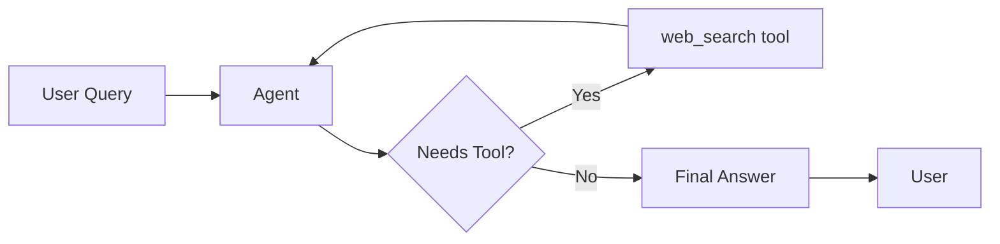

# Agent 1: Basic Agent Architecture

## Description

Simple ReAct pattern showing:
- User provides a query
- Agent decides if it needs to use a tool
- If yes, calls `web_search()` and processes results
- If no, provides final answer directly
- Returns answer to user
