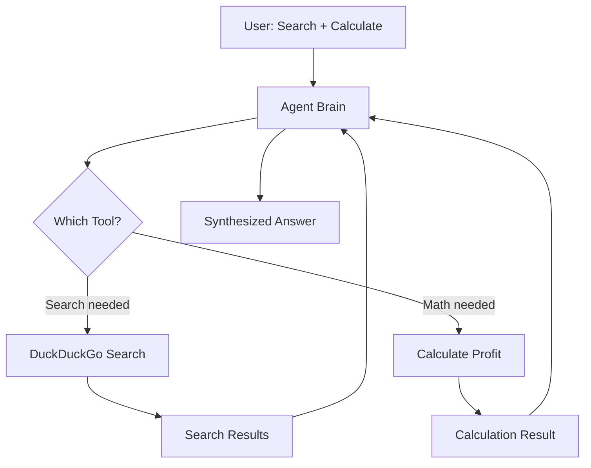

# Agent 2: Multi-Tool Agent Architecture

## Description

Multi-tool orchestration showing:
- User asks for both search and calculation
- Agent brain intelligently selects appropriate tools
- DuckDuckGo for web search
- calculate_profit for mathematical operations
- Results flow back to agent
- Agent synthesizes final answer from multiple tool outputs
