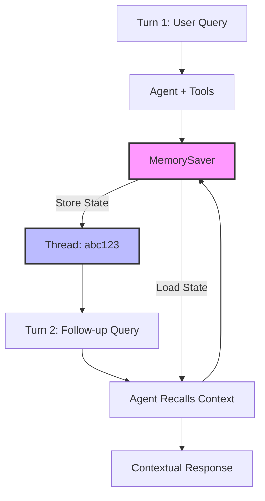

# Agent 3: Memory Agent Architecture

## Description

Stateful conversation with memory showing:
- **Turn 1**: Initial query processed and state saved
- **MemorySaver**: Checkpoint system storing conversation
- **Thread ID**: Session identifier (abc123)
- **Turn 2**: Follow-up query loads previous context
- **Agent Recalls**: Retrieves state from memory
- **Contextual Response**: Answer informed by conversation history

Key feature: Agent remembers previous interactions across turns.
