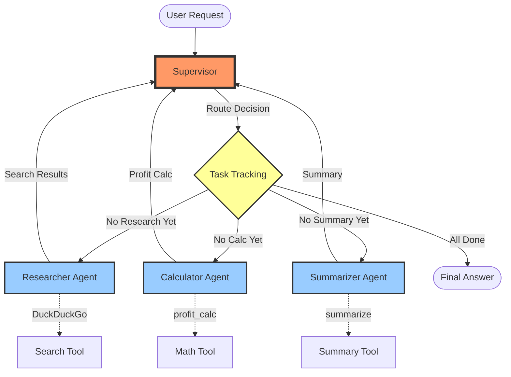

# Agent 4: Multi-Agent System Architecture

## Description

Multi-agent orchestration system showing:

**Supervisor (Red)**: Central coordinator that routes tasks
**Task Tracking (Yellow)**: Monitors what's been completed
**Specialist Agents (Blue)**:
- **Researcher**: Handles information gathering
- **Calculator**: Performs mathematical operations
- **Summarizer**: Generates summaries

**Flow**:
1. User request arrives at supervisor
2. Supervisor checks task completion status
3. Routes to appropriate specialist based on what's pending
4. Specialist completes work and returns to supervisor
5. Loop continues until all tasks complete
6. Final answer returned to user

**Tools** (dotted lines):
- Each specialist has access to specific tools
- Tools execute actual operations (search, math, summarization)
