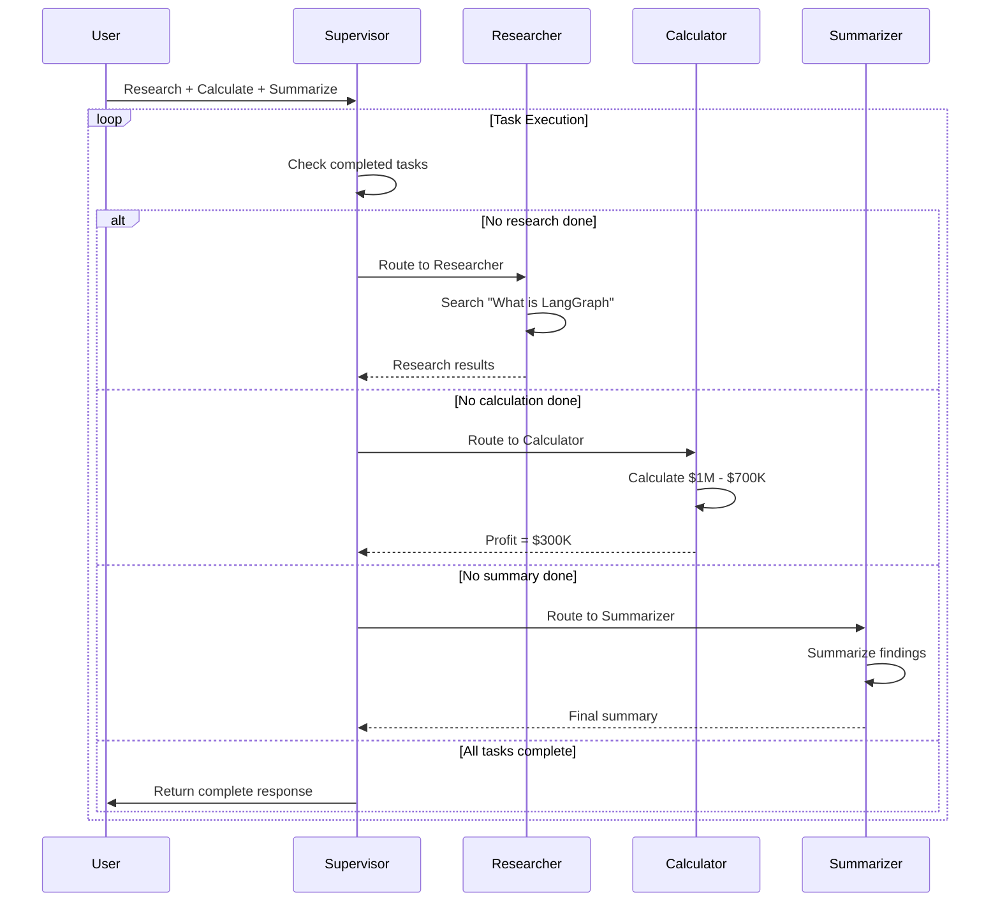

# Agent 4: Workflow Execution Sequence

## Description

Sequential execution flow showing:

**Initial Request**:
- User sends complex multi-task request to Supervisor

**Task Execution Loop**:
The supervisor repeatedly checks completion status and routes accordingly:

1. **Research Phase**:
   - If no research done → Route to Researcher
   - Researcher searches for "What is LangGraph"
   - Returns results to Supervisor

2. **Calculation Phase**:
   - If no calculation done → Route to Calculator
   - Calculator computes $1M - $700K
   - Returns $300K profit to Supervisor

3. **Summary Phase**:
   - If no summary done → Route to Summarizer
   - Summarizer generates final summary
   - Returns summary to Supervisor

4. **Completion**:
   - All tasks complete → Supervisor returns to User

**Key Pattern**: Supervisor acts as central coordinator, ensuring sequential execution and preventing infinite loops through task tracking.
