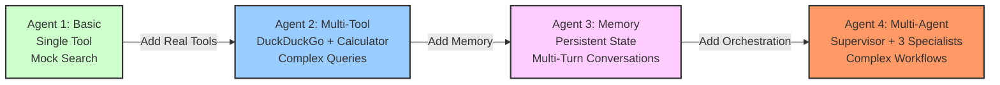

# Learning Progression - Agent Complexity

## Description

Recommended learning path showing progressive complexity:

### Stage 1: Basic (Green)
**Agent 1**: Foundation concepts
- Single tool (mock search)
- Simple ReAct pattern
- Understanding agent basics

### Stage 2: Multi-Tool (Blue)
**Agent 2**: Real-world tools
- Multiple tools (DuckDuckGo + Calculator)
- Tool selection logic
- Complex query handling
- **New Skill**: Tool orchestration

### Stage 3: Memory (Pink)
**Agent 3**: Stateful conversations
- Persistent state management
- Multi-turn dialogues
- Context retention
- **New Skill**: Conversation continuity

### Stage 4: Multi-Agent (Orange/Red)
**Agent 4**: Advanced orchestration
- Supervisor pattern
- Multiple specialist agents
- Complex workflow management
- Task decomposition
- **New Skill**: Multi-agent coordination

**Progression Strategy**: Each stage builds on previous concepts while adding one major new capability.
