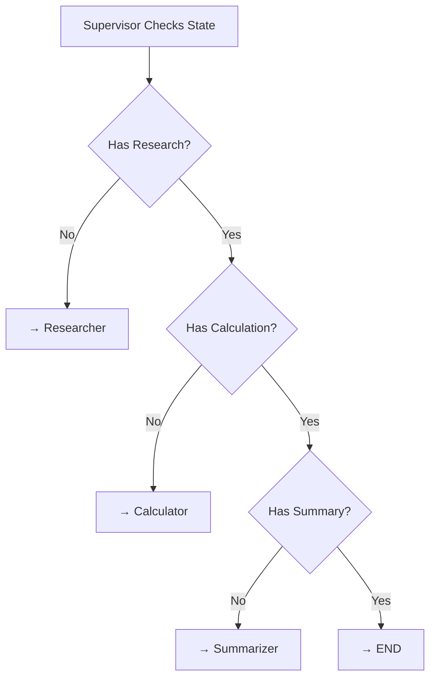

# Agent 4: Supervisor Decision Tree

## Description

Supervisor routing logic showing decision flow:

### Decision Process

**Step 1: Check Research**
- Searches message history for "research results"
- If NOT found → Route to Researcher Agent
- If found → Continue to Step 2

**Step 2: Check Calculation**
- Searches message history for "calculated profit"
- If NOT found → Route to Calculator Agent
- If found → Continue to Step 3

**Step 3: Check Summary**
- Searches message history for "final summary"
- If NOT found → Route to Summarizer Agent
- If found → All tasks complete → END

### Key Features

**Sequential Order**: Tasks execute in fixed order:
1. Research first
2. Calculation second
3. Summary last

**Loop Prevention**: Clear completion criteria at each step

**State Tracking**: Checks AI message content to determine completion

**Deterministic**: Same input always follows same path

This pattern ensures all required tasks complete exactly once before terminating.
